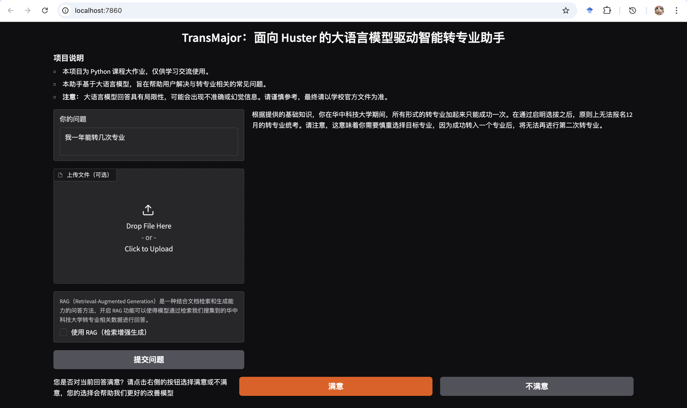

# TransMajor

面向华中科技大学本科生的转专业小助手，基于RAG实现

## 使用步骤

1. 安装相关包: `pip install openai langchain gradio langchain_openai langchain_chroma notify_py bs4`

2. 在 `config.py` 中填写 `apikey` 和 `baseurl`（可选）

3. 运行 `python app.py` 启动程序

## 效果图

